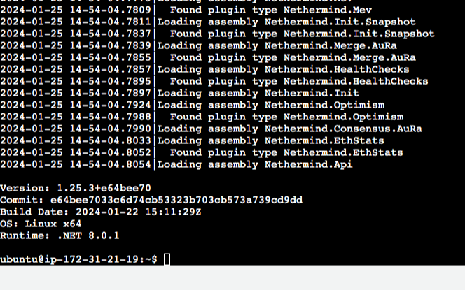
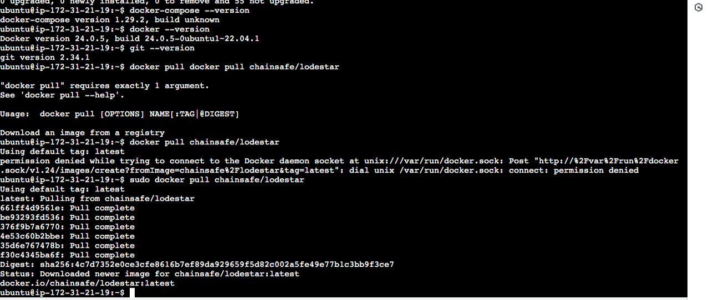

Creating a README for deploying the Nethermind Lodestar client on Ubuntu 22.04 
---

# Deploying Nethermind Lodestar Client on Ubuntu 22.04

This README provides step-by-step instructions on how I deployed the Nethermind Lodestar client on a Ubuntu 22.04 machine following the documention on 
[Nethermind's site](https://docs.nethermind.io/nethermind/first-steps-with-nethermind/running-nethermind-post-merge). 
Nethermind is an Ethereum client implementation, and Lodestar is an Ethereum 2.0 Beacon Chain client.

**Note:** To follow along, ensure that you have administrative privileges or sudo access on your Ubuntu 22.04 server.

## Prerequisites

Before you begin, make sure you have the following prerequisites:

- Ubuntu 22.04 server 
- Internet connection
- Basic knowledge of Linux command line
- Administrative access or sudo privileges

## Step 1: Update and Upgrade

Start by updating the package list and upgrading installed packages:

```bash
sudo apt update
sudo apt upgrade
```

## Step 2: Install Nethermind

Install using the following commands:

```bash
sudo add-apt-repository ppa:nethermindeth/nethermind
sudo apt install nethermind
nethermind --version
```



## Step 3: Install and run Concensus client (Lodestar)
This required installing git, docker and docker compose.
I pulled and ran the chainsafe Lodestar image follwoing the intrustions on the [documentation](https://chainsafe.github.io/lodestar/getting-started/installation/#docker-installation)

```bash
docker-compose --version`
```


```bash
docker pull chainsafe/lodestar
docker run chainsafe/lodestar
```



## Step 4: Configuring JSON-RPC interface (Create a JWT secret file)
Execution and consensus clients communicate via an authenticated endpoint specified in Engine JSON-RPC API. In order to connect to a consensus client, the execution client must generate a JWT secret at a known path. i chose /tmp directory to create mine

```bash
openssl rand -hex 32 | tr -d "\n" > "/tmp/jwtsecret"
```


## Step 5: Running Nethermind (Execution client)

Start Nethermind:

```bash
nethermind \
  -c mainnet \
  --JsonRpc.JwtSecretFile /tmp/jwtsecret
```
This command is instructing Nethermind to start and use the configuration settings for connecting to the Ethereum mainnet

Initialized Nethermind on Mainnet Ethereum Network


stopped session


